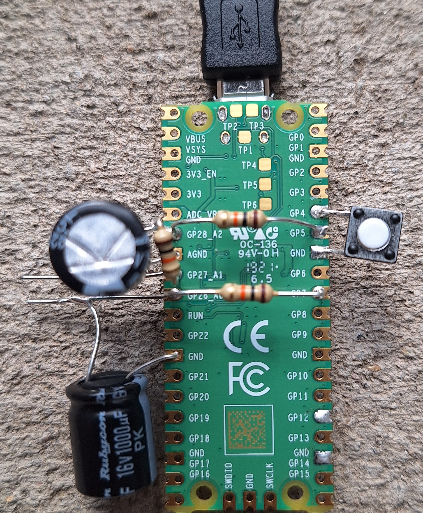
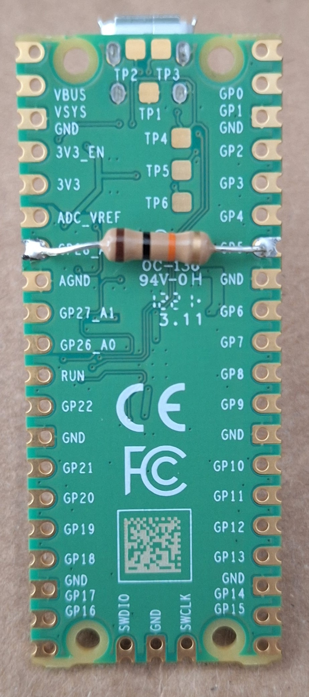
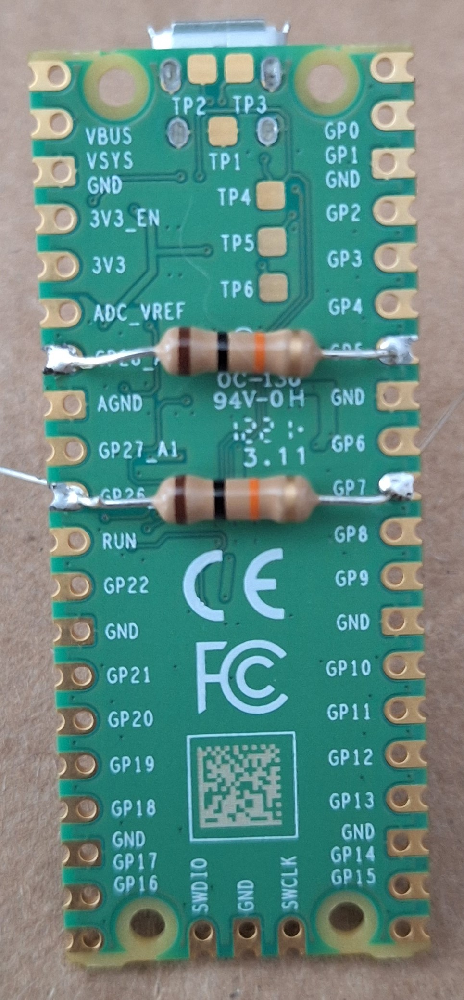
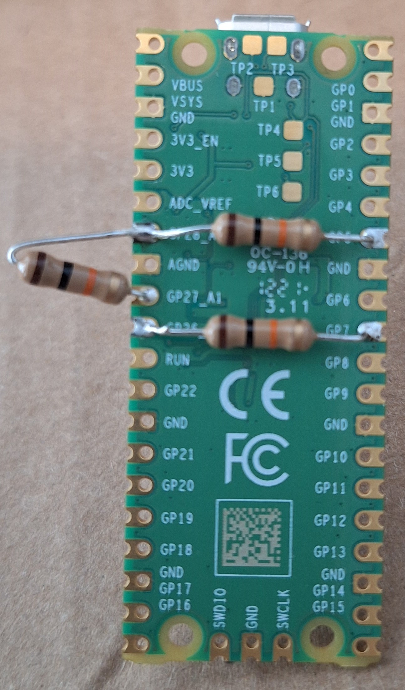
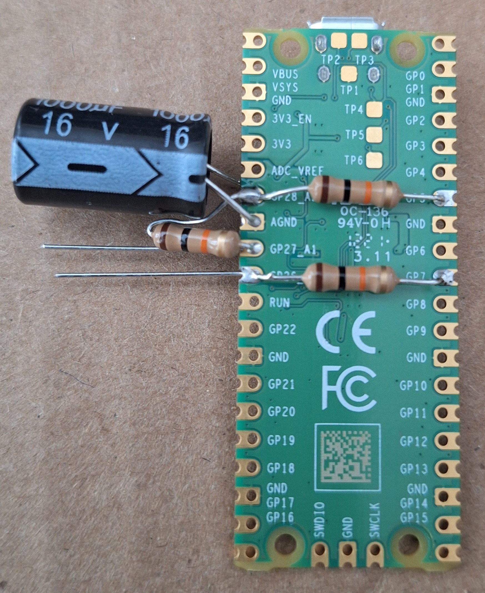
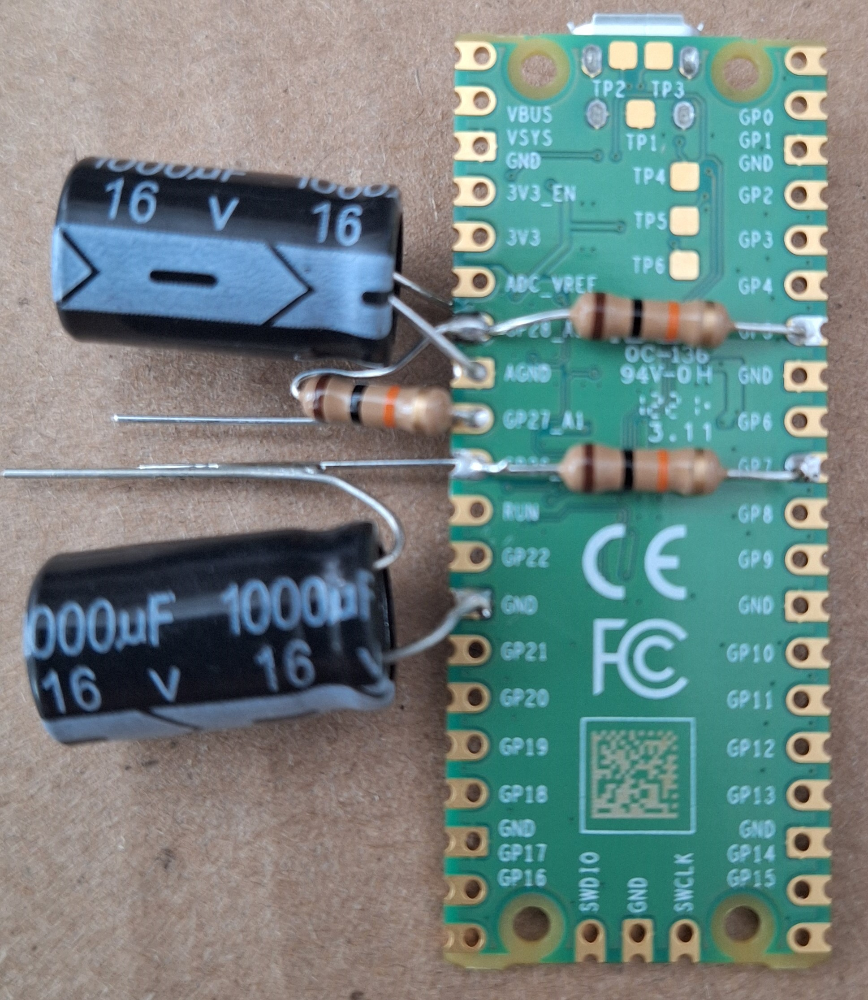
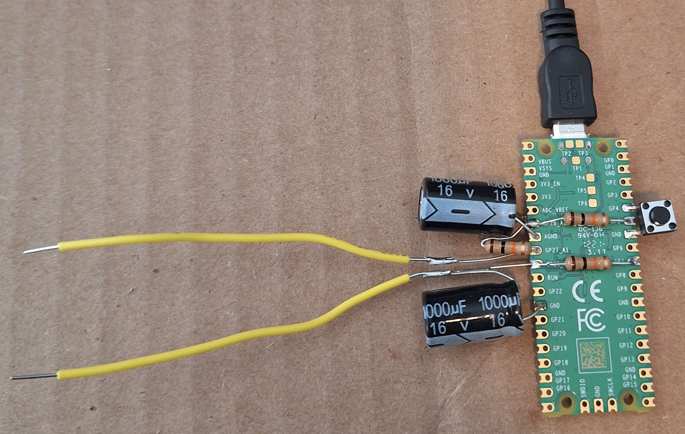
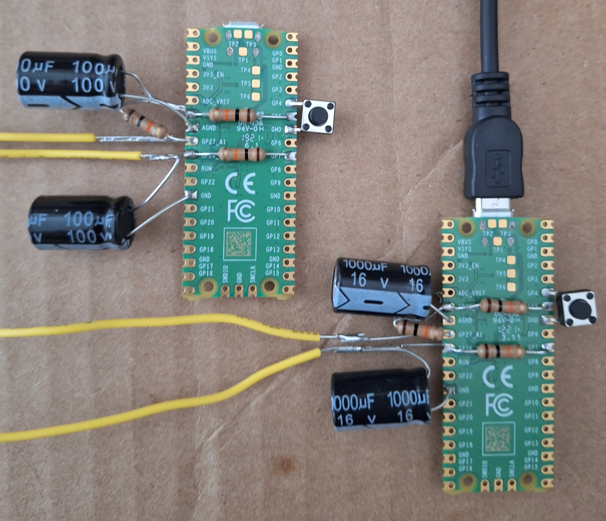
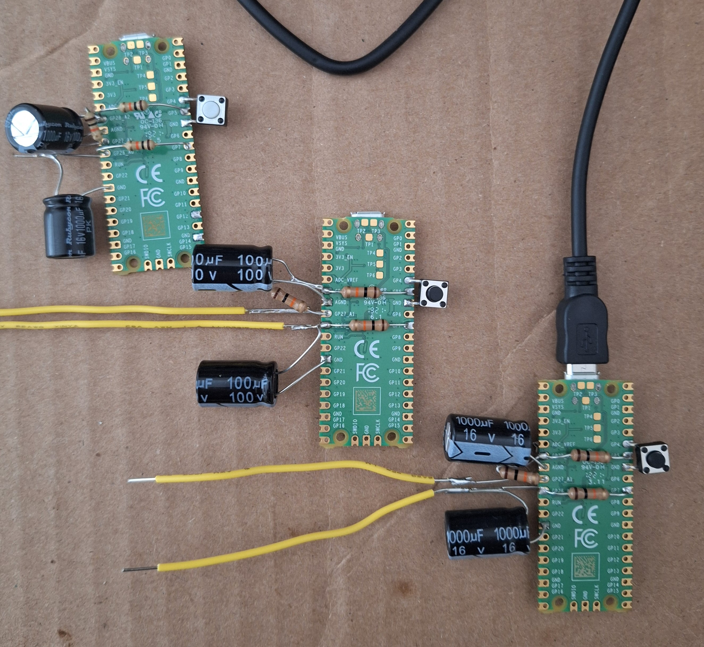

# [OMEGATRON](https://github.com/lafelabs/omegatron)


[Open Source Hardware Instrument](https://github.com/lafelabs/OSHI/) for measuring the current-voltage characteristics of a device between two electrodes.  




 - [localhost](http://localhost)
 - [circuitpython/](circuitpython/)
 - [qrcode/](qrcode/)
 - [readme set reader](readme/readme-reader.html)
 - [readme set editor](readme/readme-editor.html)
 - [webeditor.html](webeditor.html)
 - [omegatron.html](omegatron.html)

## Bill Of Materials

 - [10k resistors(need 3 per omegatron)](https://www.amazon.com/Projects-100EP51210K0-10k-Resistors-Pack/dp/B0185FIOTA)
 - [1000 uF capacitors(need 2 per omegatron)](https://www.amazon.com/uxcell-Capacitor-Aluminum-Electrolytic-Capacitors/dp/B08MZ42BYC/)
 - [Tactile momentary switch(1 per omegatron)](https://www.amazon.com/DAOKI-100Pcs-6x6x5mm-Momentary-Tactile/dp/B07X8T9D2Q/)
 - [Raspberry Pi Pico(1 per omegatron)](https://www.amazon.com/dp/B09437S9X4)
 - [Micro USB cable(1 per omegatron)](https://www.amazon.com/dp/B08J9WNP6Z)










## code.py

```
import time
import board
import analogio
import digitalio
import usb_hid
from adafruit_hid.keyboard import Keyboard
from adafruit_hid.keyboard_layout_us import KeyboardLayoutUS
from adafruit_hid.keycode import Keycode


#OMEGATRON


V0io = analogio.AnalogIn(board.A0)
V1io = analogio.AnalogIn(board.A1)
V2io = analogio.AnalogIn(board.A2)
Vlast = 1
Ilast = 1
D1io = digitalio.DigitalInOut(board.GP5)
D2io = digitalio.DigitalInOut(board.GP7)
D1io.direction = digitalio.Direction.OUTPUT
D2io.direction = digitalio.Direction.OUTPUT
button = digitalio.DigitalInOut(board.GP4)
button.direction = digitalio.Direction.INPUT
button.pull = digitalio.Pull.UP

D1io.value = True
D2io.value = False

keyboard = Keyboard(usb_hid.devices)
keyboard_layout = KeyboardLayoutUS(keyboard)  # We're in the US :)

running = False

while True:
    V0 = V0io.reference_voltage*V0io.value/65535
    V1 = V1io.reference_voltage*V1io.value/65535
    V2 = V2io.reference_voltage*V2io.value/65535
    V = V1 - V0  # voltage in volts
    if V > 1.5:
        D1io.value = False
        D2io.value = True
    if V < -1.5:
        D1io.value = True
        D2io.value = False
    I = (V2 - V1)/10000 # current in amperes

    if not(button.value):
        running = not(running)
        if not(running):
            print("STOP")
        else:
            print("START")
        time.sleep(0.2)
    print("({},{})".format(V,1e6*I)) # volts and micro amps
    if running:
        keyboard_layout.write("{} volts {} microamperes\n".format(V,1e6*I))
    Vlast = V
    Ilast = I
    time.sleep(0.1)


```


